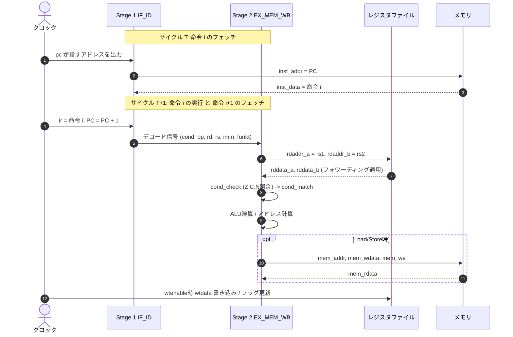

# k16 16-bit RISC CPU 詳細設計仕様書 (Hardware Architecture Specification)

本書は、k16 16bit RISC CPUのハードウェア内部構造、パイプライン動作、命令セット詳細、モジュール間インターフェースを定義する詳細設計仕様書です。

---

## 1. 全体アーキテクチャ概要

### 1.1 基本仕様
- **データパス幅**: 16-bit
- **命令ワード幅**: 24-bit 固定長
- **アドレス空間**: 16-bit（0x0000 〜 0xFFFF、64Kワード = 192KB相当）
- **メモリデータ幅**: 24-bit（命令・データ共通フォーマット）
- **パイプライン段数**: 2段
  - **Stage 1 (IF/ID)**: Instruction Fetch, Primary Decode
  - **Stage 2 (EX/MEM/WB)**: Condition Check, ALU Exec, Memory Access, Register Write-back

---

## 2. パイプライン構造とタイミング

### 2.1 パイプラインステージ定義



### 2.2 データハザードとフォワーディング (Bypass)
連続する命令間で前命令の書き込みレジスタを次命令が即座に読み出す場合（RAW: Read-After-Write）、レジスタ書き込みを待たずに直前の実行結果を次サイクルのALU入力へバイパスします。

- **フォワーディング条件**:
  ```verilog
  wire [15:0] fwd_data_a = (prev_wtenable && (prev_wtaddr == rs1)) ? prev_wtdata : rddata_a;
  wire [15:0] fwd_data_b = (prev_wtenable && (prev_wtaddr == rs2)) ? prev_wtdata : rddata_b;
  ```
- これにより、データ依存によるストール（パイプライン停止）は一切発生しません。

### 2.3 分岐（Control Hazard）とフラッシュ制御
PC（`r15`）への明示的な書き込み（分岐命令）が成立した場合：
1. クロック立ち上がりで `PC <= 分岐先アドレス` が更新される。
2. 同時に、すでにフェッチされていた直後の命令（`mem[PC+1]`）を無効化するため、次サイクルの **`ir` に `NOP`（`24'h800000`）を挿入** します。
3. 分岐ペナルティは **1サイクルバブル** のみです。

---

## 3. レジスタセット仕様

CPUは16本の16bitレジスタ（`r0` 〜 `r15`）を内蔵しています。

| 番号 | シンボル | 種別 | Read時動作 | Write時動作 | 備考 |
|---|---|---|---|---|---|
| `0` | `r0` | ゼロレジスタ | 常に `16'h0000` | 書き込み無視（破棄） | 即値代入や比較の基底として使用 |
| `1`〜`12` | `r1`〜`r12` | 汎用レジスタ | 格納データを返却 | `wtdata` を格納 | 演算・ポインタ・テンポラリ用 |
| `13` | `r13` | 拡張/汎用 | 格納データを返却 | `wtdata` を格納<br>※LD時は `topin` を格納 | `r13[7:0]` が24bitメモリ `[23:16]` と連動 |
| `14` | `r14` | フラグ | `{13'b0, N, C, Z}` | 書き込み無視 | ALU状態の読み出し |
| `15` | `r15` | PC | 現在の実行PC値 | 指定アドレスへジャンプ | 未書き込み時は毎クロック `+1` |

---

## 4. 命令セット詳細 (ISA)

### 4.1 条件コード表 (`cond[23:21]`)
全命令の最上位3bitで実行条件を指定します。条件不成立の場合、レジスタ書き込み・メモリ書き込み・フラグ更新・PC分岐が無効化（NOP化）されます。

| cond | コード | 判定式 | アセンブリ接尾辞 |
|---|---|---|---|
| `3'b000` | 常に実行 | `1'b1` | (指定なし) または `.al` |
| `3'b001` | Not Zero | `zf == 0` | `.ne` |
| `3'b010` | Not Carry | `cf == 0` | `.nc` |
| `3'b011` | Positive | `nf == 0` | `.pl` |
| `3'b100` | Never | `1'b0` | `.nv` (NOP) |
| `3'b101` | Zero | `zf == 1` | `.eq` / `.ze` |
| `3'b110` | Carry | `cf == 1` | `.cs` |
| `3'b111` | Negative | `nf == 1` | `.mi` |

---

### 4.2 命令フォーマット別詳細

#### 1) レジスタ間演算 (op = 2'b00)
`rd = rs1 (funkt) rs2`

| ビット | フィールド | 説明 |
|---|---|---|
| `[23:21]` | `cond` | 実行条件コード |
| `[20:19]` | `op` | `2'b00` |
| `[18:15]` | `rd` | 格納先レジスタ番号 (0〜15) |
| `[14:11]` | `rs1` | 第1ソースレジスタ番号 (0〜15) |
| `[10:7]` | `rs2` | 第2ソースレジスタ番号 (0〜15) |
| `[6:3]` | `unused` | 未使用（0000固定） |
| `[2:0]` | `funkt` | ALU演算コード |

#### 2) レジスタ即値演算 (op = 2'b01)
`rd = rs (funkt) {8'b0, im}`

| ビット | フィールド | 説明 |
|---|---|---|
| `[23:21]` | `cond` | 実行条件コード |
| `[20:19]` | `op` | `2'b01` |
| `[18:15]` | `rd` | 格納先レジスタ番号 (0〜15) |
| `[14:11]` | `rs` | ソースレジスタ番号 (0〜15) |
| `[10:3]` | `im` | 8-bit 即値（ゼロ拡張して16bitとして使用） |
| `[2:0]` | `funkt` | ALU演算コード |

#### 3) ロード / ストア (op = 2'b11)
- Load: `rd = mem[base ± im]`, `r13[7:0] = mem[23:16]`
- Store: `mem[base ± im] = {r13[7:0], rd}`

| ビット | フィールド | 説明 |
|---|---|---|
| `[23:21]` | `cond` | 実行条件コード |
| `[20:19]` | `op` | `2'b11` |
| `[18:15]` | `rd` | Load時: 格納先レジスタ / Store時: 格納元データレジスタ |
| `[14:11]` | `base` | ベースアドレスレジスタ (0〜15) |
| `[10:2]` | `im` | 9-bit オフセット即値（ゼロ拡張してアドレス計算） |
| `[1:0]` | `funkt` | `00`: Load(加算), `01`: Load(減算), `10`: Store(加算), `11`: Store(減算) |

---

### 4.3 ALU演算詳細 (`funkt[2:0]`)

| funkt | 演算名 | 計算式 | Zフラグ | Cフラグ | Nフラグ |
|---|---|---|---|---|---|
| `3'b000` | **NAND** | `~(A & B)` | `res == 0` | 保持 | `res[15]` |
| `3'b001` | **OR** | `A \| B` | `res == 0` | 保持 | `res[15]` |
| `3'b010` | **AND** | `A & B` | `res == 0` | 保持 | `res[15]` |
| `3'b011` | **XOR** | `A ^ B` | `res == 0` | 保持 | `res[15]` |
| `3'b100` | **ADD** | `A + B` | `res == 0` | キャリー出力 | `res[15]` |
| `3'b101` | **SUB** | `A - B` (`A + ~B + 1`) | `res == 0` | ボローなし時1 | `res[15]` |
| `3'b110` | **ADC** | `A + B + C` | `res == 0` | キャリー出力 | `res[15]` |
| `3'b111` | **SHR** | `{1'b0, A[15:1]}` | `res == 0` | `A[0]` (最下位bit) | `res[15]` (=0) |

---

## 5. モジュール間インターフェース仕様

### 5.1 CPUトップモジュール (`cpu.v`)

```verilog
module cpu (
    input  wire        clk,        // システムクロック
    input  wire        rst,        // High有効非同期リセット

    // 命令メモリポート (ROM)
    output wire [15:0] inst_addr,  // 命令フェッチアドレス (PC)
    input  wire [23:0] inst_data,  // 24bit フェッチ命令

    // データメモリポート (RAM)
    output wire [15:0] mem_addr,   // データメモリアドレス
    output wire [23:0] mem_wdata,  // データメモリ書き込みデータ
    input  wire [23:0] mem_rdata,  // データメモリ読み出しデータ
    output wire        mem_we      // データメモリライトイネーブル
);
```

---

## 6. 設計上の留意事項 (KISS原則)
1. **回路の単純性**:
   - 複雑なマルチサイクルステートマシンを排し、純粋な2段パイプライン構成を採用。
2. **クリティカルパスの短縮**:
   - ALU演算とデコードを明確に分離し、FPGAのLUTレベルで高速動作が可能なシンプルな組み合わせ論理として記述。
3. **明快なモジュール階層**:
   - `cpu.v`（統合・パイプライン）、`decoder.v`（命令デコード）、`cond_check.v`（条件判定）、`regfile.v`（レジスタ管理）、`alu.v`（演算器）に機能ごとに明確に責務を分離。
