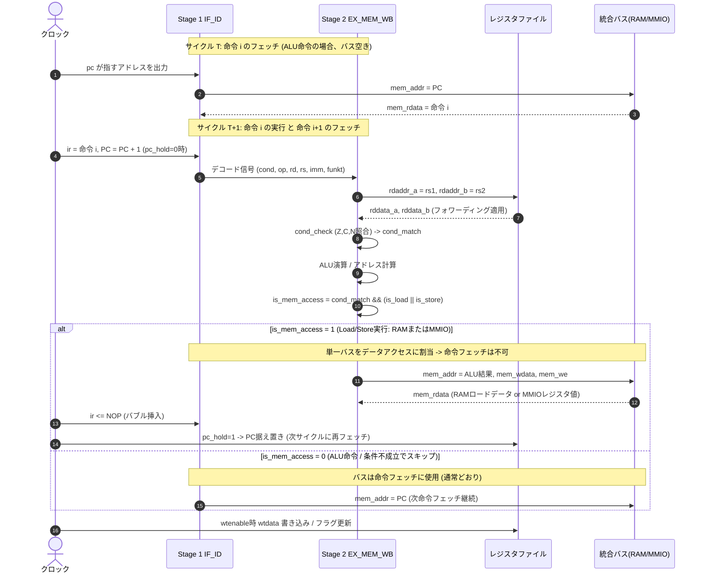

# k16 16-bit RISC CPU 詳細設計仕様書 (Hardware Architecture Specification)

本書は、k16 16bit RISC CPUのハードウェア内部構造、パイプライン動作、命令セット詳細、MMIO (UART IO) インターフェース、モジュール間構成を定義する詳細設計仕様書です。

---

## 1. 全体アーキテクチャ概要

### 1.1 基本仕様
- **データパス幅**: 16-bit
- **命令ワード幅**: 24-bit 固定長
- **アドレス空間**: 16-bit（0x0000 〜 0xFFFF、64Kワード = 192KB相当）
- **メモリデータ幅**: 24-bit（命令・データ共通フォーマット）
- **メモリアーキテクチャ**: **ノイマン型 (von Neumann)** — 命令・データを分離せず、
  単一アドレス空間・単一ポートの共有メモリバス（`mem_addr` / `mem_wdata` / `mem_rdata` / `mem_we`）
  を命令フェッチとLoad/Storeの双方で使用する。
- **I/Oインターフェース**: **MMIO (Memory Mapped I/O)** — 0xFF00〜0xFFFFの空間にUART等のI/Oペリフェラルをマッピング。
- **パイプライン段数**: 2段
  - **Stage 1 (IF/ID)**: Instruction Fetch, Primary Decode
  - **Stage 2 (EX/MEM/WB)**: Condition Check, ALU Exec, Memory/MMIO Access, Register Write-back

### 1.2 ノイマン型ボトルネックと単一バス調停
命令・データを同一の単一ポートバスで共有するため、同一サイクルに
「次命令のフェッチ」と「現在の命令(Load/Store)によるデータ/MMIOアクセス」を
両立することはできない（構造的ハザード）。

k16は以下のポリシーでこれを調停する:

1. 条件成立した Load/Store 命令(`is_mem_access = cond_match && (is_load || is_store)`)
   が Stage 2 で実行されるサイクルは、共有メモリバスをデータ/MMIOアクセス
   （アドレス = ALU結果）に割り当てる。
2. このサイクルは命令フェッチが行えないため、次サイクルの `ir` には
   `NOP` を挿入してバブル化する。
3. 同時に PC (`r15`) の自動 +1 を1サイクル停止(hold)し、フェッチできな
   かった命令のアドレスを保持する。
4. 次サイクルでバスが解放され、保持していたPCで正しく命令が再フェッチ
   される。

条件不成立でスキップされる Load/Store 命令はメモリアクセスを行わない
ため `is_mem_access` は成立せず、通常どおりフェッチが継続される。

この結果、**条件成立した Load/Store 命令は実行に1サイクルの構造的
ハザード・ストールを伴う**（ALU演算・分岐命令にはこのペナルティはない）。

---

## 2. メモリマップ & MMIO 仕様

### 2.1 アドレス空間マップ
16-bitアドレス空間（0x0000 〜 0xFFFF）は以下のように分割・割り当てられています。

| アドレス範囲 | 領域種別 | 用途 |
|---|---|---|
| `0x0000` 〜 `0xFEFF` | **メインRAM (RAM)** | 命令コード格納領域 (Fetch) および 汎用データ領域 (Load/Store) |
| `0xFF00` 〜 `0xFFFF` | **MMIO 領域** | I/Oペリフェラル制御レジスタ (UART IO等) |

### 2.2 MMIO レジスタマップ (UART I/O)

| アドレス | シンボル | R/W | ビット構成 | 動作説明 |
|---|---|---|---|---|
| `0xFF00` | `UART_DATA` | R/W | `[7:0]` | **Write (Store)**: 送信データ(下位8bit)を書き込み、UART TX送信を開始 **Read (Load)**: 受信データ(下位8bit)を読み出し、`rx_ready` フラグをクリア |
| `0xFF01` | `UART_STATUS` | R | `[1:0]` | **Read (Load)**: ステータスフラグ取得 ・`bit 0` (`tx_busy`): 1=送信中, 0=送信可能/アイドル ・`bit 1` (`rx_ready`): 1=未読受信データあり, 0=なし |
| `0xFF02` | `UART_BAUD` | R/W | `[15:0]` | (予約/拡張用) ボーレート設定レジスタ |

---

## 3. パイプライン構造とタイミング

### 3.1 パイプラインステージ定義

### 3.2 データハザードとフォワーディング (Bypass)
RAW (Read-After-Write) ハザードは直前サイクルの書き込みデータをALU入力へ直接フォワーディングすることで解消します。ストールは発生しません。

### 3.3 分岐（Control Hazard）とフラッシュ制御
PC（`r15`）への書き込みが成立した場合、次サイクルの `ir` に `NOP` を挿入して1サイクルでフラッシュします。

---

## 4. レジスタセット仕様

| 番号 | シンボル | 種別 | Read時動作 | Write時動作 | 備考 |
|---|---|---|---|---|---|
| `0` | `r0` | ゼロレジスタ | 常に `16'h0000` | 書き込み無視（破棄） | 即値代入や比較の基底として使用 |
| `1`〜`12` | `r1`〜`r12` | 汎用レジスタ | 格納データを返却 | `wtdata` を格納 | 演算・ポインタ・テンポラリ用 |
| `13` | `r13` | 拡張/汎用 | 格納データを返却 | `wtdata` を格納 ※LD時は `topin` を格納 | `r13[7:0]` が24bitメモリ `[23:16]` と連動 |
| `14` | `r14` | フラグ | `{13'b0, N, C, Z}` | 書き込み無視 | ALU状態の読み出し |
| `15` | `r15` | PC | 現在の実行PC値 | 指定アドレスへジャンプ | 未書き込み時は毎クロック `+1` |

---

## 5. 命令セット詳細 (ISA)

### 5.1 条件コード表 (`cond[23:21]`)

| cond | コード | 判定式 | アセンブリ接尾辞 |
|---|---|---|---|
| `3'b000` | 常に実行 | `1'b1` | (指定なし) または `.al` |
| `3'b001` | Not Zero | `zf == 0` | `.ne` |
| `3'b010` | Not Carry | `cf == 0` | `.nc` |
| `3'b011` | Positive | `nf == 0` | `.pl` |
| `3'b100` | Never | `1'b0` | `.nv` (NOP) |
| `3'b101` | Zero | `zf == 1` | `.eq` / `.ze` |
| `3'b110` | Carry | `cf == 1` | `.cs` |
| `3'b111` | Negative | `nf == 1` | `.mi` |

### 5.2 命令フォーマット別詳細

#### 1) レジスタ間演算 (op = 2'b00)
`rd = rs1 (funkt) rs2`

#### 2) レジスタ即値演算 (op = 2'b01)
`rd = rs (funkt) {8'b0, im}`

#### 3) ロード / ストア (op = 2'b11)
- Load: `rd = mem[base ± im]`, `r13[7:0] = mem[23:16]`
- Store: `mem[base ± im] = {r13[7:0], rd}`

---

## 6. モジュール構成とSoCトップ

### 6.1 モジュール構成一覧
- **`k16_soc.v`**: CPU, RAM, MMIO(UART)を統合したノイマン型SoCトップ
- **`cpu.v`**: 2段パイプライン CPUコア (単一メモリポート)
- **`mmio.v`**: MMIOコントローラ (0xFF00〜0xFFFFのデコードおよびUART制御)
- **`uart.v`**: 8-N-1 UART 送受信モジュール (自己完結型)
- **`ram.v`**: 24-bit幅 メインRAM (単一ポート)
- **`alu.v`**: 16-bit 算術論理演算器
- **`regfile.v`**: 16-bit×16本 レジスタファイル (pc_hold対応)
- **`decoder.v`**: 24-bit 命令デコーダ
- **`cond_check.v`**: 条件判定デコーダ
